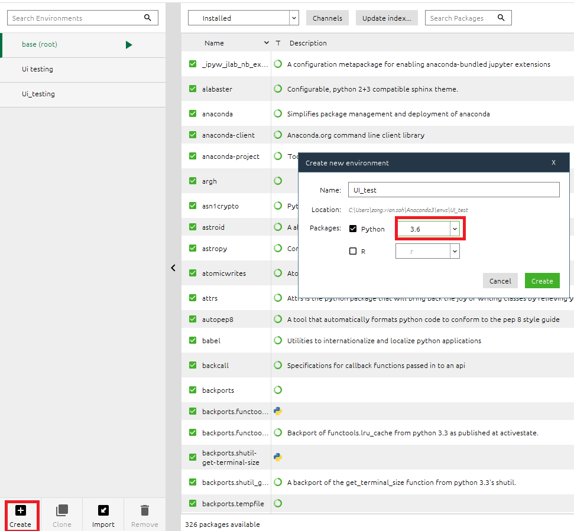
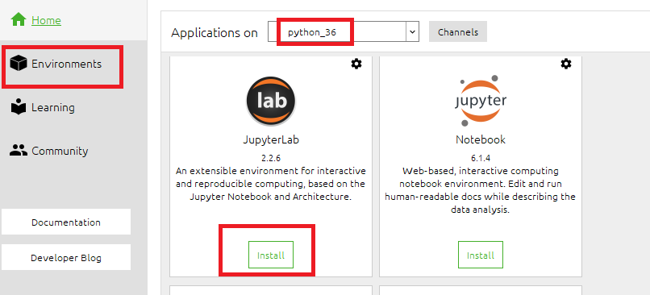
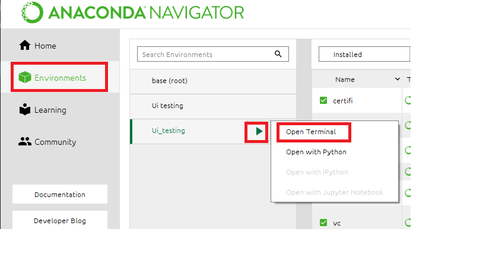

# Ui-test-framework
This is a documentation to help you start a ui-test-framework project. 

## Step 1
Install anaconda using the link:
https://docs.anaconda.com/anaconda/install/windows/

## Step 2
Press windows button and launch anaconda navigator, click on the environment tab on the left, and create an environment with python ver 3.6



## Step 3 

On that new environment, install jupyter lab



## Step 4

Download chromedriver based on the link below: 
https://chromedriver.chromium.org/downloads

Note: Check your google chrome version by clicking on the 3 dots on the top right -> help -> about google chrome and download the correct driver. 

## Step 5 

Open up anaconda command prompt, and execute the below commands. 


```
 pip install selenium 
 conda install -c anaconda beautifulsoup4
```


