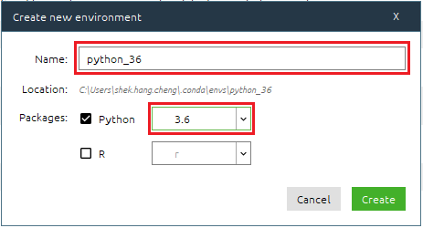

# UI Test Framework
This is a documentation to help you to setup UI test environment with Fusionex Test Framework.

## Prerequisites
* Install Anaconda version 5.2.0 (with Python 3.6)
    * Download the installer from [here](https://repo.anaconda.com/archive/Anaconda3-5.2.0-Windows-x86_64.exe)
* After installation of Anaconda in previous step, launch `Anaconda Navigator` from Windows menu
* Create virual environment `python_36` (with Python 3.6)
    * In Navigator, click the Environments tab, then click the Create button. The Create new environment dialog box appears.
    * In the Environment name field, type `python_36`.
    * In the Packages list select “Python” and in the Python version list select the version `3.6`.

      
    
    * Click the Create button.
    * Navigator creates the new environment and activates it, as shown by the highlighted green bar.

    * More information refer to this [link](https://docs.anaconda.com/anaconda/navigator/tutorials/use-multiple-python-versions/#:~:text=In%20Navigator%2C%20click%20the%20Environments,version%20you%20want%20to%20use)

* Install JupyterLab
    * In Navigator, click side menu `Home`
    * Select the new environment from previous step `python_36` from dropdown `Applications on`

      

    * Click `Install` from `JupyterLab`

      
    
    * It will take few minutes to complete the installation. 
    * Click `Launch` button after installation. The jupyterlab will be launched in your web browser.

* Install python libraries  
    * In Navigator, click side menu `Environments`.
    * Select environment `python_36`.
    * Click the play button, select `Open Terminal`.

      

    * Run the following commands to install the libraries.
      ```shell
      pip install selenium beautifulsoup4
      ```

* Download Google Chrome driver
  * Open **Google Chrome** on your PC.
  * Click the three dots in the upper-right corner of the window.
  * Select `Help` - `About Google Chrome`.
  * Check the version of the Google Chrome.
  * Download the driver based on your chrome version using this [link](https://chromedriver.chromium.org/downloads)
  * Unzip the driver zip file and save to your local machine.


  

  


